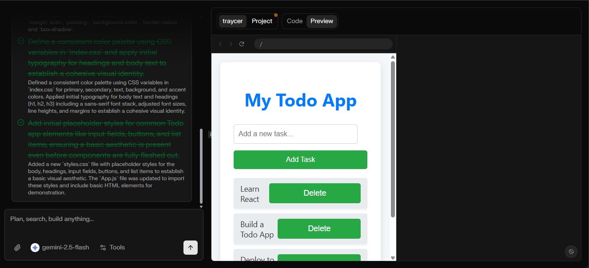

## traycer-ai-assignment

[Deployed Server on vercel](https://traycer-ai-assignment-server.vercel.app) 

[Deployed Client on vercel](https://traycer-ai-assignment.vercel.app)

[Postman collection](https://deeprajbera21-480407.postman.co/workspace/Deepraj-Bera's-Workspace~b535ead7-a26a-4ced-8d36-835752a16051/collection/49016060-71463ba3-9088-4b73-ac1c-fe0ea9ded415?action=share&creator=49016060)

## Web-app Screenshots

### Landing Page

### Dashboard Page

### Create Project

### Chat Interface

### Preview

## Backlog

- [ ] File upload in chat
- [ ] Groq implement in server
- [ ] Tools implmentaion
- [ ] save projects in db
- [ ] import projects from github